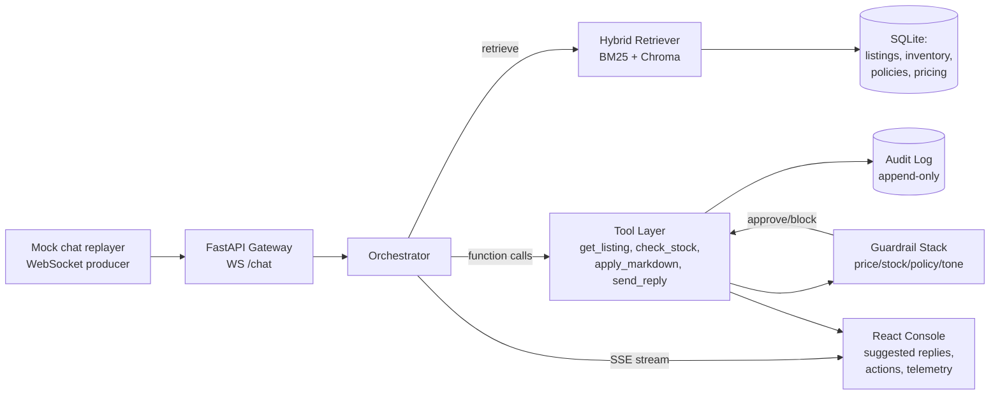

# eBay Live Seller Copilot — 48-Hour Build Plan

**Owner:** Vincent · **Start:** Fri May 1, 2026 · **Submit by:** Sun May 3, 2026

## Locked decisions

| Area | Choice | Why |
|---|---|---|
| Stack | FastAPI (Python) + React (Vite) | Python plays well with retrieval libs; FastAPI gives WebSockets + SSE out of the box |
| Data | **Real eBay catalog from `ebay-sample-data.csv`** (17.5K listings, ~800 sampled for demo); synthesized stock_qty/cost/margin and mocked chat stream + policies | Real product grounding, no API friction |
| Depth area | Retrieval + Function Calling | Most defensible technical story for an eBay reviewer |
| Docs | Notion-style HTML (single-file, with embedded mermaid diagrams) | Polished enough to email, low friction to author |
| LLM | Claude Sonnet 4.6 for reply generation, Claude Haiku 4.5 for guardrail classifiers | Sonnet for quality, Haiku for sub-100ms guardrail checks |
| Vector store | Chroma (in-process, file-backed) | No infra; rehydrates on boot |
| Lexical retrieval | rank_bm25 | Tiny, reliable, hybrid-friendly |

---

## North-star scenarios (drive the demo, drive scope)

The prototype must nail these five live moments. Anything that doesn't serve them gets cut.

1. **"Do you have this in size M?"** — grounded availability check, quoted from retrieved listing, guardrail blocks if stock = 0.
2. **"Can you do $40?"** — price negotiation; guardrail enforces floor from `pricing_rules.json`; auto-counter-offer with markdown if within floor.
3. **"What's your return policy?"** — RAG over policy docs with inline citation in the reply.
4. **"@seller this is fake"** — tone/abuse classifier flags; suggested reply only (no auto-send), human-in-loop required.
5. **Operator clicks "Push markdown 10% on SKU-042"** — function-call action with audit trail, optimistic UI, rollback button.

---

## Architecture (one page)



**Latency budget (sub-2s p95 from message-in to first token-out):**

| Stage | Budget |
|---|---|
| Ingest + parse | 50ms |
| Retrieval (BM25 ∥ embeddings) | 250ms |
| Guardrail pre-check | 100ms |
| LLM first-token (Sonnet streaming) | 800ms |
| Network + render | 200ms |
| **Total p95** | **1.4s** |
| Headroom | 600ms |

---

## Hour-by-hour timeline

### Day 1 (0–24h): Backend, retrieval, LLM core

| Block | Hours | Output |
|---|---|---|
| **Kickoff + scaffolding** | 0–2 | Repo init, `.env`, FastAPI hello-world, Vite React shell, Docker Compose for Chroma optional |
| **Mock data generator** | 2–5 | `gen_data.py` produces 150 SKUs (electronics/apparel/collectibles), 4 policy docs, pricing_rules.json with floor margins, brand_tone.md, 60 scripted chat messages covering all 5 scenarios |
| **Catalog + retrieval layer** | 5–10 | SQLite schema (listings, inventory, policies, audit_log); Chroma index over listing text + policy chunks; BM25 index in-memory; `Retriever.search(query, k)` returns hybrid top-k with scores |
| **WebSocket chat ingest** | 10–13 | `/ws/chat` endpoint; replayer script pumps messages at variable rate; per-message session state |
| **LLM reply engine v0** | 13–18 | Anthropic SDK with tool definitions (`get_listing`, `check_inventory`, `search_catalog`, `apply_markdown`, `swap_listing`, `adjust_stock`, `send_reply`); streaming via SSE; system prompt with tone + grounding rules |
| **Function-calling loop** | 18–22 | Multi-turn tool use: model calls retrievers → gets context → drafts reply with citations → guardrails → suggested or auto-send |
| **Sleep / buffer** | 22–24 | Don't skip |

### Day 2 (24–48h): Guardrails, UI, polish, docs

| Block | Hours | Output |
|---|---|---|
| **Guardrail stack** | 24–29 | 4 layers: (1) deterministic price/stock checks against SQLite, (2) policy regex + semantic match, (3) tone classifier (Haiku call), (4) hallucination check — every factual claim must map to a retrieved chunk. Block vs. warn vs. require-human modes. |
| **Audit trail + rollback** | 29–31 | Every tool call writes append-only row with input/output/guardrail verdict; `/api/rollback/{action_id}` reverses last inventory/price action |
| **Frontend: live console** | 31–37 | Three-pane layout: chat feed (left), suggested-reply queue with accept/edit/reject (center), inventory + action panel (right); live metrics strip (latency, queue depth, auto-send rate); SSE consumer for token streaming |
| **Latency tuning** | 37–40 | Parallel retrieval, prompt cache for system prompt, switch high-volume guardrails to Haiku, measure with k6 — confirm p95 < 2s |
| **Demo data tightening** | 40–42 | Seed the 5 scenarios so they fire reliably; add a "demo mode" that replays them on click |
| **PRD (Notion-style HTML)** | 42–44 | Single HTML file, embedded mermaid: copilot→agentic ladder, pilot design (3–5 sellers, 4-week ramp), MVP scope, co-build model, GMV + operator-load metrics |
| **TDD (Notion-style HTML)** | 44–46 | Architecture diagram, retrieval design, guardrail stack, audit/rollback, latency budget, eBay API integration plan (sandbox→prod), failure modes |
| **Final QA + Loom** | 46–48 | Smoke test all 5 scenarios end-to-end, record 3-min walkthrough, write submission email |

---

## Repo layout

```
liveselling-copilot/
├── backend/
│   ├── app/
│   │   ├── main.py              # FastAPI entry, WS routes
│   │   ├── orchestrator.py      # LLM loop, tool dispatch
│   │   ├── retrieval/
│   │   │   ├── hybrid.py        # BM25 + Chroma fusion
│   │   │   └── chunker.py
│   │   ├── tools/
│   │   │   ├── catalog.py       # get_listing, search_catalog
│   │   │   ├── inventory.py     # check_stock, adjust_stock
│   │   │   ├── pricing.py       # apply_markdown
│   │   │   └── messaging.py     # send_reply
│   │   ├── guardrails/
│   │   │   ├── price.py
│   │   │   ├── stock.py
│   │   │   ├── policy.py
│   │   │   ├── tone.py          # Haiku-backed
│   │   │   └── grounding.py     # citation enforcement
│   │   ├── audit.py             # append-only log + rollback
│   │   └── db.py
│   ├── data/
│   │   ├── gen_data.py
│   │   ├── catalog.db           # SQLite, generated
│   │   ├── chroma/              # vector index, generated
│   │   ├── policies/*.md
│   │   └── chat_replay.jsonl
│   └── tests/
├── frontend/
│   ├── src/
│   │   ├── App.tsx
│   │   ├── panes/{ChatFeed,ReplyQueue,InventoryPanel}.tsx
│   │   ├── hooks/{useChatStream,useReplyStream}.ts
│   │   └── components/{LatencyStrip,AuditDrawer}.tsx
│   └── vite.config.ts
├── docs/
│   ├── prd.html
│   └── tdd.html
└── README.md
```

---

## Mock data spec

**Catalog (~800 SKUs sampled from `ebay-sample-data.csv`):** real fields — uniq_id (used as SKU), title, manufacturer, model_name, model_num, price ($-string parsed to float), stock (boolean), color_category, internal_memory, screen_size, carrier, average_rating, num_of_reviews, seller_rating, seller_num_of_reviews, pageurl, discontinued, broken_link. **Synthesized:** stock_qty (int 0–50, biased by Stock=True), cost (= price × random 0.55–0.75), margin_floor_pct (8–18%), category (derived from manufacturer + title heuristics).

**Policies (4 docs, ~500 words each):** returns, shipping, authenticity, prohibited claims.

**Pricing rules (JSON):** per-category min margin, max markdown %, bundle rules.

**Brand tone guide (markdown):** voice (warm, direct), banned phrases, escalation cues.

**Chat replay (60 messages, jsonl):** mix of buyers asking sizes, prices, shipping, returns, plus 2 abusive, 3 negotiation, 5 quick-buy intents, multiple SKUs referenced.

---

## Tool / function-call schemas (locked early — frontend mocks against these)

```python
get_listing(sku: str) -> Listing
search_catalog(query: str, k: int = 5) -> List[Listing]
check_inventory(sku: str) -> {qty: int, reserved: int}
apply_markdown(sku: str, pct: float, reason: str) -> {ok, new_price, audit_id}
swap_listing(from_sku: str, to_sku: str) -> {ok, audit_id}
adjust_stock(sku: str, delta: int, reason: str) -> {ok, new_qty, audit_id}
send_reply(text: str, citations: List[str], auto: bool) -> {ok, message_id, audit_id}
```

Every write tool returns an `audit_id` that the UI keeps so the operator can rollback in one click.

---

## Risks & mitigations

| Risk | Mitigation |
|---|---|
| Sub-2s latency target slips | Pre-warm Anthropic client, cache system prompt, run guardrails in parallel with first-token streaming, fall back to Haiku for replies if Sonnet too slow |
| Function-calling loop infinite-loops | Hard cap at 4 tool turns; circuit-break and downgrade to "suggested reply only" |
| Guardrails too strict → nothing auto-sends | Three modes per rule: block / warn / human-required; default policy/tone to "human-required", price/stock to "block" |
| Demo SKU IDs drift from chat replay | Seed both from same generator with fixed random seed |
| HTML docs look amateur | Use a clean CSS reset + mermaid CDN; one accent color; no clipart |
| Burnout on hour 36 | Sleep is in the plan. Don't trade it for "one more feature." |

---

## Definition of done

- [ ] All 5 north-star scenarios fire end-to-end without manual intervention
- [ ] p95 first-token latency under 2s, measured and visible in UI
- [ ] Every auto-send has a guardrail verdict in the audit log
- [ ] Rollback works for at least `apply_markdown` and `adjust_stock`
- [ ] Citations appear inline in every grounded reply
- [ ] PRD covers: ladder, pilot, MVP scope, co-build, metrics
- [ ] TDD covers: ingestion, retrieval, guardrails, audit, latency, eBay API plan, rollback
- [ ] 3-minute Loom walkthrough recorded
- [ ] Submission email drafted with all three artifacts attached

---

## Submission checklist (hour 47)

1. Public GitHub repo (or zip) with README that runs in <5 min
2. `docs/prd.html` + `docs/tdd.html`
3. Loom link
4. Email reply with: 1-paragraph summary, repo link, doc links, Loom link, list of known limitations
